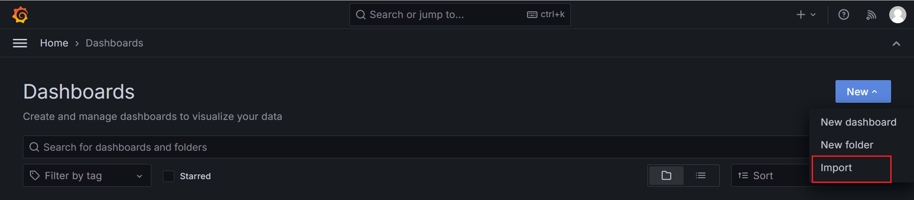
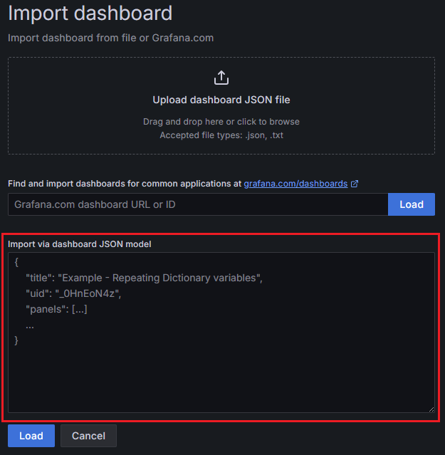

# Prometheus & Grafana 設定文件
## Prometheus
### prometheus.yml
```yaml
global:
  scrape_interval: 15s # Set the scrape interval to every 15 seconds. Default is every 1 minute.
  evaluation_interval: 15s # Evaluate rules every 15 seconds. The default is every 1 minute.

scrape_configs:
  - job_name: "prometheus"
    static_configs:
      - targets: ["localhost:9090"]
  - job_name: windows_exporter"
    static_configs:
      - targets: ["localhost:9182"]
  - job_name: 'springboot'
    metrics_path: '/actuator/prometheus'
    static_configs:
      - targets: ['localhost:8080', 'localhost:8081', 'localhost:8082']
```

## Windows Exporter
### config.yml
```yaml
collectors:
  enabled: cpu,cs,net,service,memory,os,logical_disk,process
collector:
  service:
    services-where: "Name='windows_exporter'"
log:
  level: warn
```
啟動指定 config.yml：
```shell
windows_exporter.exe --config.file=config.yml
```

## Grafana Dashboards
1. New dashboard → Import dashboard
    
2. Import via dashboard JSON model

    
    ```json
    {
      "annotations": {
        "list": [
          {
            "builtIn": 1,
            "datasource": {
              "type": "grafana",
              "uid": "-- Grafana --"
            },
            "enable": true,
            "hide": true,
            "iconColor": "rgba(0, 211, 255, 1)",
            "name": "Annotations & Alerts",
            "type": "dashboard"
          }
        ]
      },
      "editable": true,
      "fiscalYearStartMonth": 0,
      "graphTooltip": 0,
      "id": 3,
      "links": [],
      "panels": [
        {
          "datasource": {
            "type": "prometheus",
            "uid": "cdkgx7kf7f9c0a"
          },
          "description": "",
          "fieldConfig": {
            "defaults": {
              "color": {
                "mode": "thresholds"
              },
              "mappings": [
                {
                  "options": {
                    "0": {
                      "color": "red",
                      "index": 1,
                      "text": "Off"
                    },
                    "1": {
                      "color": "green",
                      "index": 0,
                      "text": "On"
                    }
                  },
                  "type": "value"
                }
              ],
              "thresholds": {
                "mode": "absolute",
                "steps": [
                  {
                    "color": "green",
                    "value": null
                  },
                  {
                    "color": "red",
                    "value": 0
                  },
                  {
                    "color": "green",
                    "value": 1
                  }
                ]
              }
            },
            "overrides": []
          },
          "gridPos": {
            "h": 4,
            "w": 24,
            "x": 0,
            "y": 0
          },
          "id": 7,
          "options": {
            "colorMode": "value",
            "graphMode": "none",
            "justifyMode": "center",
            "orientation": "auto",
            "reduceOptions": {
              "calcs": [
                "lastNotNull"
              ],
              "fields": "",
              "values": false
            },
            "showPercentChange": false,
            "text": {},
            "textMode": "auto",
            "wideLayout": true
          },
          "pluginVersion": "10.4.2",
          "targets": [
            {
              "datasource": {
                "type": "prometheus",
                "uid": "cdkgx7kf7f9c0a"
              },
              "disableTextWrap": false,
              "editorMode": "builder",
              "expr": "up{instance=\"localhost:8080\"}",
              "fullMetaSearch": false,
              "includeNullMetadata": true,
              "instant": false,
              "legendFormat": "manager",
              "range": true,
              "refId": "manager",
              "useBackend": false
            },
            {
              "datasource": {
                "type": "prometheus",
                "uid": "cdkgx7kf7f9c0a"
              },
              "disableTextWrap": false,
              "editorMode": "builder",
              "expr": "up{instance=\"localhost:8081\"}",
              "fullMetaSearch": false,
              "hide": false,
              "includeNullMetadata": true,
              "instant": false,
              "legendFormat": "agent1",
              "range": true,
              "refId": "agent1",
              "useBackend": false
            },
            {
              "datasource": {
                "type": "prometheus",
                "uid": "cdkgx7kf7f9c0a"
              },
              "disableTextWrap": false,
              "editorMode": "builder",
              "expr": "up{instance=\"localhost:8082\"}",
              "fullMetaSearch": false,
              "hide": false,
              "includeNullMetadata": true,
              "instant": false,
              "legendFormat": "agent2",
              "range": true,
              "refId": "agent2",
              "useBackend": false
            }
          ],
          "title": "啟動狀態",
          "type": "stat"
        },
        {
          "collapsed": false,
          "gridPos": {
            "h": 1,
            "w": 24,
            "x": 0,
            "y": 4
          },
          "id": 16,
          "panels": [],
          "title": "CPU Usage",
          "type": "row"
        },
        {
          "datasource": {
            "type": "prometheus",
            "uid": "cdkgx7kf7f9c0a"
          },
          "description": "",
          "fieldConfig": {
            "defaults": {
              "color": {
                "mode": "palette-classic"
              },
              "custom": {
                "axisBorderShow": false,
                "axisCenteredZero": false,
                "axisColorMode": "text",
                "axisLabel": "",
                "axisPlacement": "auto",
                "barAlignment": 0,
                "drawStyle": "line",
                "fillOpacity": 0,
                "gradientMode": "none",
                "hideFrom": {
                  "legend": false,
                  "tooltip": false,
                  "viz": false
                },
                "insertNulls": false,
                "lineInterpolation": "linear",
                "lineWidth": 1,
                "pointSize": 5,
                "scaleDistribution": {
                  "type": "linear"
                },
                "showPoints": "auto",
                "spanNulls": false,
                "stacking": {
                  "group": "A",
                  "mode": "none"
                },
                "thresholdsStyle": {
                  "mode": "off"
                }
              },
              "mappings": [],
              "max": 100,
              "min": 0,
              "thresholds": {
                "mode": "absolute",
                "steps": [
                  {
                    "color": "green",
                    "value": null
                  },
                  {
                    "color": "red",
                    "value": 80
                  }
                ]
              },
              "unit": "percent"
            },
            "overrides": []
          },
          "gridPos": {
            "h": 7,
            "w": 8,
            "x": 0,
            "y": 5
          },
          "id": 17,
          "options": {
            "legend": {
              "calcs": [],
              "displayMode": "list",
              "placement": "bottom",
              "showLegend": true
            },
            "tooltip": {
              "mode": "single",
              "sort": "none"
            }
          },
          "pluginVersion": "10.4.2",
          "targets": [
            {
              "datasource": {
                "type": "prometheus",
                "uid": "cdkgx7kf7f9c0a"
              },
              "editorMode": "code",
              "expr": "system_cpu_usage{instance=~\"localhost:8080\"} * 100",
              "instant": false,
              "legendFormat": "manager cpu usage",
              "range": true,
              "refId": "A"
            }
          ],
          "title": "manager CPU Usage",
          "type": "timeseries"
        },
        {
          "datasource": {
            "type": "prometheus",
            "uid": "cdkgx7kf7f9c0a"
          },
          "description": "",
          "fieldConfig": {
            "defaults": {
              "color": {
                "mode": "palette-classic"
              },
              "custom": {
                "axisBorderShow": false,
                "axisCenteredZero": false,
                "axisColorMode": "text",
                "axisLabel": "",
                "axisPlacement": "auto",
                "barAlignment": 0,
                "drawStyle": "line",
                "fillOpacity": 0,
                "gradientMode": "none",
                "hideFrom": {
                  "legend": false,
                  "tooltip": false,
                  "viz": false
                },
                "insertNulls": false,
                "lineInterpolation": "linear",
                "lineWidth": 1,
                "pointSize": 5,
                "scaleDistribution": {
                  "type": "linear"
                },
                "showPoints": "auto",
                "spanNulls": false,
                "stacking": {
                  "group": "A",
                  "mode": "none"
                },
                "thresholdsStyle": {
                  "mode": "off"
                }
              },
              "mappings": [],
              "max": 100,
              "min": 0,
              "thresholds": {
                "mode": "absolute",
                "steps": [
                  {
                    "color": "green",
                    "value": null
                  },
                  {
                    "color": "red",
                    "value": 80
                  }
                ]
              },
              "unit": "percent"
            },
            "overrides": []
          },
          "gridPos": {
            "h": 7,
            "w": 8,
            "x": 8,
            "y": 5
          },
          "id": 18,
          "options": {
            "legend": {
              "calcs": [],
              "displayMode": "list",
              "placement": "bottom",
              "showLegend": true
            },
            "tooltip": {
              "mode": "single",
              "sort": "none"
            }
          },
          "pluginVersion": "10.4.2",
          "targets": [
            {
              "datasource": {
                "type": "prometheus",
                "uid": "cdkgx7kf7f9c0a"
              },
              "editorMode": "code",
              "expr": "system_cpu_usage{instance=~\"localhost:8081\"} * 100",
              "instant": false,
              "legendFormat": "agent1 cpu usage",
              "range": true,
              "refId": "A"
            }
          ],
          "title": "agent1 CPU Usage",
          "type": "timeseries"
        },
        {
          "datasource": {
            "type": "prometheus",
            "uid": "cdkgx7kf7f9c0a"
          },
          "description": "",
          "fieldConfig": {
            "defaults": {
              "color": {
                "mode": "palette-classic"
              },
              "custom": {
                "axisBorderShow": false,
                "axisCenteredZero": false,
                "axisColorMode": "text",
                "axisLabel": "",
                "axisPlacement": "auto",
                "barAlignment": 0,
                "drawStyle": "line",
                "fillOpacity": 0,
                "gradientMode": "none",
                "hideFrom": {
                  "legend": false,
                  "tooltip": false,
                  "viz": false
                },
                "insertNulls": false,
                "lineInterpolation": "linear",
                "lineWidth": 1,
                "pointSize": 5,
                "scaleDistribution": {
                  "type": "linear"
                },
                "showPoints": "auto",
                "spanNulls": false,
                "stacking": {
                  "group": "A",
                  "mode": "none"
                },
                "thresholdsStyle": {
                  "mode": "off"
                }
              },
              "mappings": [],
              "max": 100,
              "min": 0,
              "thresholds": {
                "mode": "absolute",
                "steps": [
                  {
                    "color": "green",
                    "value": null
                  },
                  {
                    "color": "red",
                    "value": 80
                  }
                ]
              },
              "unit": "percent"
            },
            "overrides": []
          },
          "gridPos": {
            "h": 7,
            "w": 8,
            "x": 16,
            "y": 5
          },
          "id": 19,
          "options": {
            "legend": {
              "calcs": [],
              "displayMode": "list",
              "placement": "bottom",
              "showLegend": true
            },
            "tooltip": {
              "mode": "single",
              "sort": "none"
            }
          },
          "pluginVersion": "10.4.2",
          "targets": [
            {
              "datasource": {
                "type": "prometheus",
                "uid": "cdkgx7kf7f9c0a"
              },
              "editorMode": "code",
              "expr": "system_cpu_usage{instance=~\"localhost:8082\"} * 100",
              "instant": false,
              "legendFormat": "agent2 cpu usage",
              "range": true,
              "refId": "A"
            }
          ],
          "title": "agent2 CPU Usage",
          "type": "timeseries"
        },
        {
          "collapsed": false,
          "gridPos": {
            "h": 1,
            "w": 24,
            "x": 0,
            "y": 12
          },
          "id": 9,
          "panels": [],
          "title": "JVM Memory",
          "type": "row"
        },
        {
          "datasource": {
            "type": "prometheus",
            "uid": "cdkgx7kf7f9c0a"
          },
          "description": "Heap：\n  - G1 Eden Space：表示 JVM 堆中的 Eden 空間，用於存放新創建的物件。\n  - G1 Old Gen：表示 JVM 堆中的老年代，用於存放較長時間存活的物件。\n  - G1 Survivor Space：表示 JVM 堆中的倖存者空間，用於存放經過一次 Minor GC（年輕代垃圾回收）後存活的對象。\n\nNon-Heap（非堆）：\n  - CodeCache：用於存放已編譯的代碼，包括 JIT（即時編譯器）編譯的代碼。\n  - Compressed Class Space：用於存放類的中繼資料資訊，經過壓縮處理以節省記憶體空間。\n  - Metaspace：用於存放類的中繼資料，包括類的結構、欄位、方法等資訊。",
          "fieldConfig": {
            "defaults": {
              "color": {
                "mode": "palette-classic"
              },
              "custom": {
                "axisBorderShow": false,
                "axisCenteredZero": false,
                "axisColorMode": "text",
                "axisLabel": "",
                "axisPlacement": "auto",
                "barAlignment": 0,
                "drawStyle": "line",
                "fillOpacity": 0,
                "gradientMode": "none",
                "hideFrom": {
                  "legend": false,
                  "tooltip": false,
                  "viz": false
                },
                "insertNulls": false,
                "lineInterpolation": "linear",
                "lineWidth": 1,
                "pointSize": 5,
                "scaleDistribution": {
                  "type": "linear"
                },
                "showPoints": "auto",
                "spanNulls": false,
                "stacking": {
                  "group": "A",
                  "mode": "none"
                },
                "thresholdsStyle": {
                  "mode": "off"
                }
              },
              "mappings": [],
              "thresholds": {
                "mode": "absolute",
                "steps": [
                  {
                    "color": "green",
                    "value": null
                  },
                  {
                    "color": "red",
                    "value": 80
                  }
                ]
              },
              "unit": "bytes"
            },
            "overrides": []
          },
          "gridPos": {
            "h": 8,
            "w": 8,
            "x": 0,
            "y": 13
          },
          "id": 2,
          "options": {
            "legend": {
              "calcs": [],
              "displayMode": "list",
              "placement": "bottom",
              "showLegend": true
            },
            "tooltip": {
              "mode": "single",
              "sort": "none"
            }
          },
          "targets": [
            {
              "datasource": {
                "type": "prometheus",
                "uid": "cdkgx7kf7f9c0a"
              },
              "disableTextWrap": false,
              "editorMode": "builder",
              "exemplar": false,
              "expr": "jvm_memory_used_bytes{job=\"springboot\", instance=\"localhost:8080\"}",
              "format": "time_series",
              "fullMetaSearch": false,
              "includeNullMetadata": true,
              "instant": false,
              "interval": "",
              "legendFormat": "{{area}}_{{id}}",
              "range": true,
              "refId": "A",
              "useBackend": false
            }
          ],
          "title": "manager JVM 記憶體使用量",
          "type": "timeseries"
        },
        {
          "datasource": {
            "type": "prometheus",
            "uid": "cdkgx7kf7f9c0a"
          },
          "description": "Heap：\n  - G1 Eden Space：表示 JVM 堆中的 Eden 空間，用於存放新創建的物件。\n  - G1 Old Gen：表示 JVM 堆中的老年代，用於存放較長時間存活的物件。\n  - G1 Survivor Space：表示 JVM 堆中的倖存者空間，用於存放經過一次 Minor GC（年輕代垃圾回收）後存活的對象。\n\nNon-Heap（非堆）：\n  - CodeCache：用於存放已編譯的代碼，包括 JIT（即時編譯器）編譯的代碼。\n  - Compressed Class Space：用於存放類的中繼資料資訊，經過壓縮處理以節省記憶體空間。\n  - Metaspace：用於存放類的中繼資料，包括類的結構、欄位、方法等資訊。",
          "fieldConfig": {
            "defaults": {
              "color": {
                "mode": "palette-classic"
              },
              "custom": {
                "axisBorderShow": false,
                "axisCenteredZero": false,
                "axisColorMode": "text",
                "axisLabel": "",
                "axisPlacement": "auto",
                "barAlignment": 0,
                "drawStyle": "line",
                "fillOpacity": 0,
                "gradientMode": "none",
                "hideFrom": {
                  "legend": false,
                  "tooltip": false,
                  "viz": false
                },
                "insertNulls": false,
                "lineInterpolation": "linear",
                "lineWidth": 1,
                "pointSize": 5,
                "scaleDistribution": {
                  "type": "linear"
                },
                "showPoints": "auto",
                "spanNulls": false,
                "stacking": {
                  "group": "A",
                  "mode": "none"
                },
                "thresholdsStyle": {
                  "mode": "off"
                }
              },
              "mappings": [],
              "thresholds": {
                "mode": "absolute",
                "steps": [
                  {
                    "color": "green",
                    "value": null
                  },
                  {
                    "color": "red",
                    "value": 80
                  }
                ]
              },
              "unit": "bytes"
            },
            "overrides": []
          },
          "gridPos": {
            "h": 8,
            "w": 8,
            "x": 8,
            "y": 13
          },
          "id": 3,
          "options": {
            "legend": {
              "calcs": [],
              "displayMode": "list",
              "placement": "bottom",
              "showLegend": true
            },
            "tooltip": {
              "mode": "single",
              "sort": "none"
            }
          },
          "targets": [
            {
              "datasource": {
                "type": "prometheus",
                "uid": "cdkgx7kf7f9c0a"
              },
              "disableTextWrap": false,
              "editorMode": "builder",
              "expr": "jvm_memory_used_bytes{job=\"springboot\", instance=\"localhost:8081\"}",
              "fullMetaSearch": false,
              "includeNullMetadata": true,
              "instant": false,
              "legendFormat": "{{area}}_{{id}}",
              "range": true,
              "refId": "A",
              "useBackend": false
            }
          ],
          "title": "agent1 JVM 記憶體使用量",
          "type": "timeseries"
        },
        {
          "datasource": {
            "type": "prometheus",
            "uid": "cdkgx7kf7f9c0a"
          },
          "description": "Heap：\n  - G1 Eden Space：表示 JVM 堆中的 Eden 空間，用於存放新創建的物件。\n  - G1 Old Gen：表示 JVM 堆中的老年代，用於存放較長時間存活的物件。\n  - G1 Survivor Space：表示 JVM 堆中的倖存者空間，用於存放經過一次 Minor GC（年輕代垃圾回收）後存活的對象。\n\nNon-Heap（非堆）：\n  - CodeCache：用於存放已編譯的代碼，包括 JIT（即時編譯器）編譯的代碼。\n  - Compressed Class Space：用於存放類的中繼資料資訊，經過壓縮處理以節省記憶體空間。\n  - Metaspace：用於存放類的中繼資料，包括類的結構、欄位、方法等資訊。",
          "fieldConfig": {
            "defaults": {
              "color": {
                "mode": "palette-classic"
              },
              "custom": {
                "axisBorderShow": false,
                "axisCenteredZero": false,
                "axisColorMode": "text",
                "axisLabel": "",
                "axisPlacement": "auto",
                "barAlignment": 0,
                "drawStyle": "line",
                "fillOpacity": 0,
                "gradientMode": "none",
                "hideFrom": {
                  "legend": false,
                  "tooltip": false,
                  "viz": false
                },
                "insertNulls": false,
                "lineInterpolation": "linear",
                "lineWidth": 1,
                "pointSize": 5,
                "scaleDistribution": {
                  "type": "linear"
                },
                "showPoints": "auto",
                "spanNulls": false,
                "stacking": {
                  "group": "A",
                  "mode": "none"
                },
                "thresholdsStyle": {
                  "mode": "off"
                }
              },
              "mappings": [],
              "thresholds": {
                "mode": "absolute",
                "steps": [
                  {
                    "color": "green",
                    "value": null
                  },
                  {
                    "color": "red",
                    "value": 80
                  }
                ]
              },
              "unit": "bytes"
            },
            "overrides": []
          },
          "gridPos": {
            "h": 8,
            "w": 8,
            "x": 16,
            "y": 13
          },
          "id": 4,
          "options": {
            "legend": {
              "calcs": [],
              "displayMode": "list",
              "placement": "bottom",
              "showLegend": true
            },
            "tooltip": {
              "mode": "single",
              "sort": "none"
            }
          },
          "targets": [
            {
              "datasource": {
                "type": "prometheus",
                "uid": "cdkgx7kf7f9c0a"
              },
              "disableTextWrap": false,
              "editorMode": "builder",
              "expr": "jvm_memory_used_bytes{job=\"springboot\", instance=\"localhost:8082\"}",
              "fullMetaSearch": false,
              "includeNullMetadata": true,
              "instant": false,
              "legendFormat": "{{area}}_{{id}}",
              "range": true,
              "refId": "A",
              "useBackend": false
            }
          ],
          "title": "agent2 JVM 記憶體使用量",
          "type": "timeseries"
        },
        {
          "collapsed": false,
          "gridPos": {
            "h": 1,
            "w": 24,
            "x": 0,
            "y": 21
          },
          "id": 8,
          "panels": [],
          "title": "Windows 主機",
          "type": "row"
        },
        {
          "datasource": {
            "type": "prometheus",
            "uid": "cdkgx7kf7f9c0a"
          },
          "fieldConfig": {
            "defaults": {
              "color": {
                "mode": "thresholds"
              },
              "decimals": 0,
              "mappings": [],
              "thresholds": {
                "mode": "absolute",
                "steps": [
                  {
                    "color": "text",
                    "value": null
                  }
                ]
              },
              "unit": "s"
            },
            "overrides": []
          },
          "gridPos": {
            "h": 3,
            "w": 5,
            "x": 0,
            "y": 22
          },
          "id": 11,
          "options": {
            "colorMode": "value",
            "graphMode": "none",
            "justifyMode": "auto",
            "orientation": "horizontal",
            "reduceOptions": {
              "calcs": [
                "lastNotNull"
              ],
              "fields": "",
              "values": false
            },
            "showPercentChange": false,
            "textMode": "auto",
            "wideLayout": true
          },
          "pluginVersion": "10.4.2",
          "targets": [
            {
              "datasource": {
                "type": "prometheus",
                "uid": "cdkgx7kf7f9c0a"
              },
              "editorMode": "code",
              "expr": "windows_os_time{instance=~\"localhost:9182\"} - on () windows_process_start_time{creating_process_id=\"0\",instance=\"localhost:9182\",process=\"Idle\",process_id=\"0\"}",
              "instant": false,
              "legendFormat": "__auto",
              "range": true,
              "refId": "A"
            }
          ],
          "title": "Uptime",
          "type": "stat"
        },
        {
          "datasource": {
            "type": "prometheus",
            "uid": "cdkgx7kf7f9c0a"
          },
          "fieldConfig": {
            "defaults": {
              "color": {
                "mode": "thresholds"
              },
              "decimals": 1,
              "mappings": [
                {
                  "options": {
                    "null": {
                      "color": "text",
                      "index": 0,
                      "text": "N/A"
                    }
                  },
                  "type": "value"
                }
              ],
              "max": 96,
              "min": 0,
              "thresholds": {
                "mode": "absolute",
                "steps": [
                  {
                    "color": "green",
                    "value": null
                  },
                  {
                    "color": "orange",
                    "value": 60
                  },
                  {
                    "color": "red",
                    "value": 80
                  }
                ]
              },
              "unit": "percent"
            },
            "overrides": []
          },
          "gridPos": {
            "h": 5,
            "w": 5,
            "x": 5,
            "y": 22
          },
          "id": 6,
          "options": {
            "minVizHeight": 75,
            "minVizWidth": 75,
            "orientation": "horizontal",
            "reduceOptions": {
              "calcs": [
                "lastNotNull"
              ],
              "fields": "",
              "values": false
            },
            "showThresholdLabels": false,
            "showThresholdMarkers": true,
            "sizing": "auto"
          },
          "pluginVersion": "10.4.2",
          "targets": [
            {
              "datasource": {
                "type": "prometheus",
                "uid": "cdkgx7kf7f9c0a"
              },
              "editorMode": "code",
              "expr": "100 - (avg by (instance) (irate(windows_cpu_time_total{mode=\"idle\"}[1m])) * 100)",
              "instant": false,
              "legendFormat": "CPU 使用率",
              "range": true,
              "refId": "CPU"
            }
          ],
          "title": "CPU Usage",
          "type": "gauge"
        },
        {
          "datasource": {
            "type": "prometheus",
            "uid": "cdkgx7kf7f9c0a"
          },
          "fieldConfig": {
            "defaults": {
              "color": {
                "mode": "thresholds"
              },
              "decimals": 1,
              "mappings": [
                {
                  "options": {
                    "null": {
                      "color": "light-red",
                      "index": 0,
                      "text": "N/A"
                    }
                  },
                  "type": "value"
                }
              ],
              "max": 100,
              "min": 0,
              "thresholds": {
                "mode": "absolute",
                "steps": [
                  {
                    "color": "green",
                    "value": null
                  },
                  {
                    "color": "orange",
                    "value": 70
                  },
                  {
                    "color": "red",
                    "value": 90
                  }
                ]
              },
              "unit": "percent"
            },
            "overrides": []
          },
          "gridPos": {
            "h": 5,
            "w": 5,
            "x": 10,
            "y": 22
          },
          "id": 5,
          "options": {
            "minVizHeight": 75,
            "minVizWidth": 75,
            "orientation": "horizontal",
            "reduceOptions": {
              "calcs": [
                "lastNotNull"
              ],
              "fields": "",
              "values": false
            },
            "showThresholdLabels": false,
            "showThresholdMarkers": true,
            "sizing": "auto"
          },
          "pluginVersion": "10.4.2",
          "targets": [
            {
              "datasource": {
                "type": "prometheus",
                "uid": "cdkgx7kf7f9c0a"
              },
              "editorMode": "code",
              "expr": "(windows_cs_physical_memory_bytes{instance=~\"localhost:9182\"} - windows_os_physical_memory_free_bytes{instance=~\"localhost:9182\"}) / windows_cs_physical_memory_bytes{instance=~\"localhost:9182\"} * 100",
              "instant": false,
              "legendFormat": "",
              "range": true,
              "refId": "Memory"
            }
          ],
          "title": "Memory Usage",
          "type": "gauge"
        },
        {
          "datasource": {
            "type": "prometheus",
            "uid": "cdkgx7kf7f9c0a"
          },
          "fieldConfig": {
            "defaults": {
              "color": {
                "mode": "thresholds"
              },
              "decimals": 0,
              "mappings": [],
              "max": 100,
              "min": 0,
              "thresholds": {
                "mode": "absolute",
                "steps": [
                  {
                    "color": "green",
                    "value": null
                  },
                  {
                    "color": "#EAB839",
                    "value": 80
                  },
                  {
                    "color": "red",
                    "value": 90
                  }
                ]
              },
              "unit": "percent"
            },
            "overrides": []
          },
          "gridPos": {
            "h": 10,
            "w": 9,
            "x": 15,
            "y": 22
          },
          "id": 14,
          "options": {
            "displayMode": "basic",
            "maxVizHeight": 300,
            "minVizHeight": 16,
            "minVizWidth": 8,
            "namePlacement": "auto",
            "orientation": "horizontal",
            "reduceOptions": {
              "calcs": [
                "lastNotNull"
              ],
              "fields": "",
              "values": false
            },
            "showUnfilled": true,
            "sizing": "auto",
            "valueMode": "color"
          },
          "pluginVersion": "10.4.2",
          "targets": [
            {
              "datasource": {
                "type": "prometheus",
                "uid": "cdkgx7kf7f9c0a"
              },
              "editorMode": "code",
              "expr": "100 - (windows_logical_disk_free_bytes{instance=~\"localhost:9182\"} / windows_logical_disk_size_bytes{instance=~\"localhost:9182\"}) * 100",
              "instant": false,
              "legendFormat": "{{ volume }}",
              "range": true,
              "refId": "A"
            }
          ],
          "title": "Hard Disk Usage",
          "type": "bargauge"
        },
        {
          "datasource": {
            "type": "prometheus",
            "uid": "cdkgx7kf7f9c0a"
          },
          "fieldConfig": {
            "defaults": {
              "color": {
                "mode": "thresholds"
              },
              "decimals": 0,
              "mappings": [],
              "thresholds": {
                "mode": "absolute",
                "steps": [
                  {
                    "color": "text",
                    "value": null
                  }
                ]
              },
              "unit": "bytes"
            },
            "overrides": []
          },
          "gridPos": {
            "h": 3,
            "w": 5,
            "x": 0,
            "y": 25
          },
          "id": 12,
          "options": {
            "colorMode": "value",
            "graphMode": "none",
            "justifyMode": "auto",
            "orientation": "horizontal",
            "reduceOptions": {
              "calcs": [
                "lastNotNull"
              ],
              "fields": "",
              "values": false
            },
            "showPercentChange": false,
            "textMode": "auto",
            "wideLayout": true
          },
          "pluginVersion": "10.4.2",
          "targets": [
            {
              "datasource": {
                "type": "prometheus",
                "uid": "cdkgx7kf7f9c0a"
              },
              "editorMode": "code",
              "expr": "windows_cs_physical_memory_bytes",
              "instant": false,
              "legendFormat": "__auto",
              "range": true,
              "refId": "A"
            }
          ],
          "title": "RAM",
          "type": "stat"
        },
        {
          "datasource": {
            "type": "prometheus",
            "uid": "cdkgx7kf7f9c0a"
          },
          "fieldConfig": {
            "defaults": {
              "color": {
                "mode": "thresholds"
              },
              "decimals": 1,
              "mappings": [
                {
                  "options": {
                    "null": {
                      "color": "light-red",
                      "index": 0,
                      "text": "N/A"
                    }
                  },
                  "type": "value"
                }
              ],
              "max": 100,
              "min": 0,
              "thresholds": {
                "mode": "absolute",
                "steps": [
                  {
                    "color": "green",
                    "value": null
                  },
                  {
                    "color": "orange",
                    "value": 70
                  },
                  {
                    "color": "red",
                    "value": 90
                  }
                ]
              },
              "unit": "percent"
            },
            "overrides": []
          },
          "gridPos": {
            "h": 5,
            "w": 5,
            "x": 5,
            "y": 27
          },
          "id": 10,
          "options": {
            "minVizHeight": 75,
            "minVizWidth": 75,
            "orientation": "horizontal",
            "reduceOptions": {
              "calcs": [
                "lastNotNull"
              ],
              "fields": "",
              "values": false
            },
            "showThresholdLabels": false,
            "showThresholdMarkers": true,
            "sizing": "auto"
          },
          "pluginVersion": "10.4.2",
          "targets": [
            {
              "datasource": {
                "type": "prometheus",
                "uid": "cdkgx7kf7f9c0a"
              },
              "editorMode": "code",
              "expr": "(sum(windows_logical_disk_size_bytes{volume!~\"Harddisk.*\", instance=\"localhost:9182\"}) by (instance) - sum(windows_logical_disk_free_bytes{volume!~\"Harddisk.*\", instance=\"localhost:9182\"}) by (instance)) / sum(windows_logical_disk_size_bytes{volume!~\"Harddisk.*\", instance=\"localhost:9182\"}) by (instance) * 100",
              "instant": false,
              "legendFormat": "",
              "range": true,
              "refId": "Memory"
            }
          ],
          "title": "Disk Usage",
          "type": "gauge"
        },
        {
          "datasource": {
            "type": "prometheus",
            "uid": "cdkgx7kf7f9c0a"
          },
          "fieldConfig": {
            "defaults": {
              "color": {
                "mode": "thresholds"
              },
              "decimals": 0,
              "mappings": [
                {
                  "options": {
                    "null": {
                      "color": "light-red",
                      "index": 0,
                      "text": "N/A"
                    }
                  },
                  "type": "value"
                }
              ],
              "max": 100000000,
              "min": 0,
              "thresholds": {
                "mode": "absolute",
                "steps": [
                  {
                    "color": "green",
                    "value": null
                  },
                  {
                    "color": "orange",
                    "value": 70000000
                  },
                  {
                    "color": "red",
                    "value": 90000000
                  }
                ]
              },
              "unit": "bps"
            },
            "overrides": []
          },
          "gridPos": {
            "h": 5,
            "w": 5,
            "x": 10,
            "y": 27
          },
          "id": 15,
          "options": {
            "minVizHeight": 75,
            "minVizWidth": 75,
            "orientation": "horizontal",
            "reduceOptions": {
              "calcs": [
                "lastNotNull"
              ],
              "fields": "",
              "values": false
            },
            "showThresholdLabels": false,
            "showThresholdMarkers": true,
            "sizing": "auto"
          },
          "pluginVersion": "10.4.2",
          "targets": [
            {
              "datasource": {
                "type": "prometheus",
                "uid": "cdkgx7kf7f9c0a"
              },
              "editorMode": "code",
              "expr": "(sum(irate(windows_net_bytes_total{instance=\"localhost:9182\"}[1m])) > 1) * 8",
              "instant": false,
              "legendFormat": "",
              "range": true,
              "refId": "Memory"
            },
            {
              "datasource": {
                "type": "prometheus",
                "uid": "cdkgx7kf7f9c0a"
              },
              "editorMode": "code",
              "expr": "  sum(irate(windows_net_bytes_total{instance=~\"localhost:9182\",nic=\"Red_Hat_VirtIO_Ethernet_Adapter\"}[5m])) / sum(windows_net_current_bandwidth{instance=~\"localhost:9182\",nic=\"Red_Hat_VirtIO_Ethernet_Adapter\"}/8) * 100",
              "hide": false,
              "instant": false,
              "legendFormat": "__auto",
              "range": true,
              "refId": "A"
            }
          ],
          "title": "Bandwidth",
          "type": "gauge"
        },
        {
          "datasource": {
            "type": "prometheus",
            "uid": "cdkgx7kf7f9c0a"
          },
          "fieldConfig": {
            "defaults": {
              "color": {
                "mode": "thresholds"
              },
              "decimals": 0,
              "mappings": [],
              "thresholds": {
                "mode": "absolute",
                "steps": [
                  {
                    "color": "text",
                    "value": null
                  }
                ]
              },
              "unit": "none"
            },
            "overrides": []
          },
          "gridPos": {
            "h": 4,
            "w": 5,
            "x": 0,
            "y": 28
          },
          "id": 13,
          "options": {
            "colorMode": "value",
            "graphMode": "none",
            "justifyMode": "auto",
            "orientation": "horizontal",
            "reduceOptions": {
              "calcs": [
                "lastNotNull"
              ],
              "fields": "",
              "values": false
            },
            "showPercentChange": false,
            "textMode": "auto",
            "wideLayout": true
          },
          "pluginVersion": "10.4.2",
          "targets": [
            {
              "datasource": {
                "type": "prometheus",
                "uid": "cdkgx7kf7f9c0a"
              },
              "editorMode": "code",
              "expr": "windows_cs_logical_processors{}",
              "instant": false,
              "legendFormat": "__auto",
              "range": true,
              "refId": "A"
            }
          ],
          "title": "Processors",
          "type": "stat"
        }
      ],
      "refresh": "5s",
      "schemaVersion": 39,
      "tags": [],
      "templating": {
        "list": []
      },
      "time": {
        "from": "now-5m",
        "to": "now"
      },
      "timepicker": {
        "refresh_intervals": [
          "5s",
          "10s",
          "30s",
          "1m",
          "5m",
          "15m",
          "30m",
          "1h",
          "2h",
          "1d"
        ]
      },
      "timezone": "browser",
      "title": "Spring Batch 監控",
      "uid": "ddl5ehlvsritcb",
      "version": 24,
      "weekStart": ""
    }
    ```
